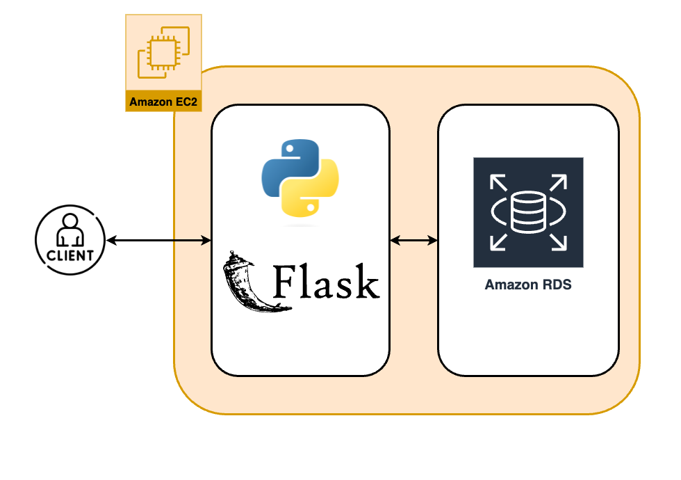
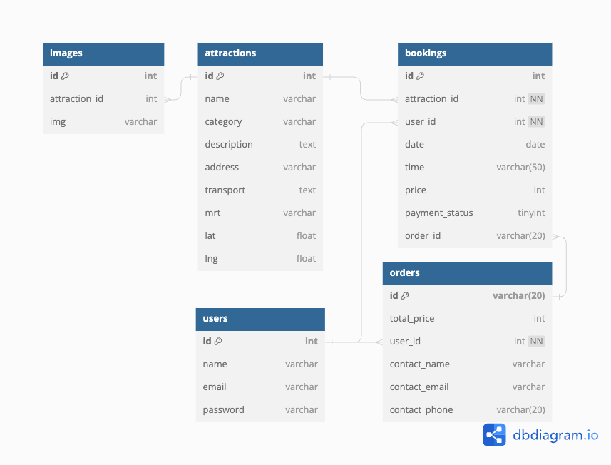
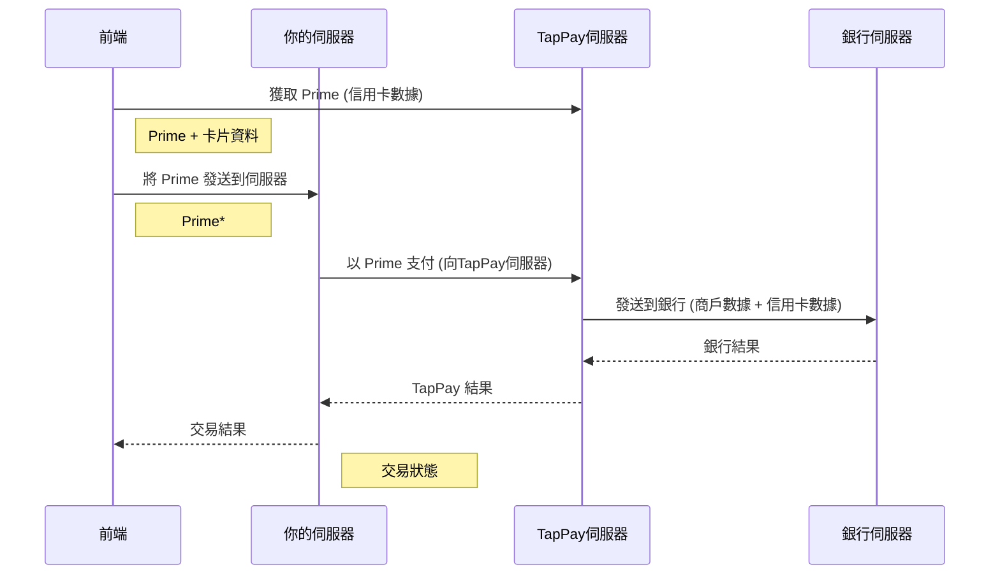
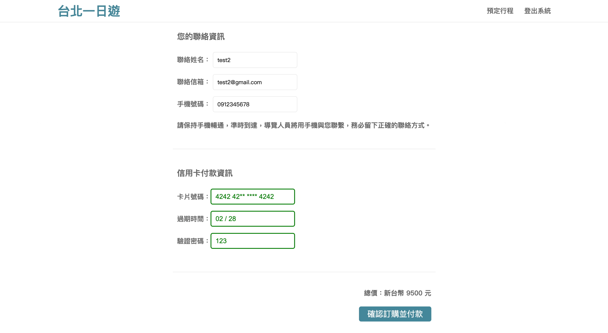

# Taipei-Day-Trip

## DEMO : [Taipei-Day-Trip](https://taipei-day-trip.myvcard.xyz/)

Taipei-Day-Trip 是以公開資料建置的台北旅遊規劃電商網站，主要功能如下:

* 首頁景點篩選：可以搜尋景點、滾輪篩選捷運站，以及無限滾輪載入更多景點
* 景點詳細資料：預先載入更多景點照片，提升使用者體驗
* 預定行程付款：顯示購物車清單，透過TapPay第三方金流付

## 測試會員帳號＆信用卡

* 測試會員帳號

| E-mail             | test2@gmail.com |
| :----------------- | --------------- |
| **Password** | **test2** |

* 測試信用卡號

| Card number               | 4242-4242-4242-4242 |
| :------------------------ | ------------------- |
| **Expiration date** | **02/28**     |
| **CVV**             | **123**       |

## 技術說明

### 前端

* HTML
* CSS
* JavaScript
* Jinja2
* RWD

### 後端

* Python / Flask
* MVC
* RESTful API
* JWT - 儲存使用者資料
* Bcrypt - 會員密碼 hash 處理

### 資料庫

* MySQL
* ORM - Flask-SQLAlchemy

### API

* TapPay

### 雲端服務

* AWS EC2
* AWS RDS

### 部署

* Nginx
* Domain Name System (DNS)
* HTTP & HTTPS
* SSL ( Let's Encrypt )

## 系統架構圖

## 資料庫架構圖

## 功能介紹

會員註冊會透過 Bcrypt 將密碼進行 hash 處理，提升安全性

首頁透過無限滾輪，達成分頁載入景點，並可以搜尋景點及篩選捷運站

預先載入更多景點照片，並且完整顯示預定行程

透過第三方金流 TapPay 付款，流程如下：

1. **取得Prime** ：在前端使用 TapPay 提供的 SDK 收集信用卡資料並取得一個加密的代碼（Prime）。
2. **發送到伺服器** ：將 Prime 從前端發送到你的後端伺服器。
3. **使用 Prime 進行支付** ：後端伺服器將 Prime 及其他交易資料（如金額、貨幣等）發送到TapPay伺服器進行支付。
4. **發送到銀行** ：TapPay 伺服器接收到支付請求後，向銀行伺服器發送必要的資料，進行交易授權。
5. **銀行結果** ：銀行伺服器處理請求並回傳結果到 TapPay 伺服器，包括授權碼、交易狀態等。
6. **TapPay結果** ：TapPay 伺服器將交易結果發送回你的後端伺服器。
7. **結果** ：後端伺服器將交易結果發送回前端，前端根據結果更新用戶介面。

網站使用 RWD 響應式設計，提升用戶體驗

